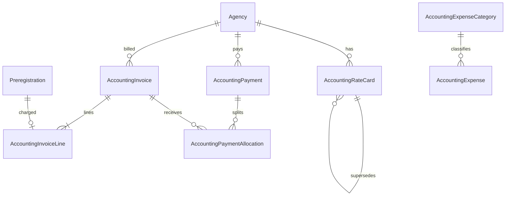

# Contabilidad — Plan de implementación por fases

Documento derivado del análisis de impacto. **No modifica** el flujo operativo actual (preregistro → saco → NIC → entrega).

## Contexto organizacional (actualizado)

Antes de Contabilidad, el negocio cambia de estructura y marca:

| Hoy en código | Nuevo modelo |
|---|---|
| SkyLink One y CH LOGISTICS son **ambas** `is_main` (pares) | Solo **SkyLink One** es raíz / marca dueña del sistema |
| Subagencias cuelgan de SLO **o** de CH (1 nivel) | **CH Logistics** pasa a ser **agencia cliente / subagencia de SkyLink One** |
| — | CH **sigue pudiendo** tener subagencias propias (árbol: `SLO → CH → sub-CH`) |
| Marca del panel: **BCH Tracking** + `images/bch-tracking-logo.png` | **PrimeTrack Group** + logo/paleta navy (**aplicado en UI**) |

Implicaciones para Contabilidad y para el módulo de agencias:

1. **Bill-to** sigue siendo por `agency_id`, pero los reportes deben poder **rollup** (SLO ve CH + subagencias de CH; CH ve solo su red).
2. Tarifas por agencia (CH y cada subagencia) sin hardcode; la jerarquía no sustituye las rate cards.
3. Etiquetas/comprobantes: `isChLogistics()` / `isSkyLinkOne()` deben recorrer **ancestros**, no solo el padre directo (hoy CH como hijo de SLO rompería detección de marca CH en nietos).
4. Crear subagencia: hoy solo se permite `parent` con `is_main`. Hay que permitir padre = CH aunque CH ya no sea `is_main`.
5. Rename/logo del sistema es **independiente** de Contabilidad, pero conviene hacerlo antes o en paralelo a Fase 0 (menú Contabilidad) para no reimprimir “BCH” en facturas nuevas.

Nombre y logo **aplicados** en UI. Prefijo notas: **mantener `BCH-`**. Etiquetas: marca SLO/CH por agencia. Revisión cerrada: `docs/LISTA-CAMBIOS-REVISION.md`. **Siguiente código autorizado: Bloque B (jerarquía)**.

---

## Decisiones de diseño (defaults aplicados)

| Pregunta | Default | Motivo |
|---|---|---|
| Cómo atacarlo | **Por fases** | Reduce riesgo en producción |
| Quién se factura (bill-to) | **Agencia** (`agency_id`) | B2B; el destinatario (`label_name` / `AgencyClient`) es operativo |
| Prioridad #1 | **Parámetros + costo/lb + rentabilidad** | Base de todo lo demás; cero bloqueo operativo |

Si más adelante se factura al cliente final, se añade un bill-to opcional sin reescribir tarifas. Con la nueva jerarquía, los reportes deben soportar **rollup** por árbol (SLO → CH → sub-CH).

---

## Principios de no-regresión (obligatorios en todas las fases)

1. Contabilidad es **módulo paralelo**; no bloquea escaneo, consolidación ni entrega.
2. No reutilizar `deliveries.invoice_number` como factura del sistema. UI: **“Factura BCH”** vs **“Nº factura externa”**.
3. Monto por peso: `verified_weight_lbs` si existe; si no, `intake_weight_lbs`. Reajuste documentado si el peso se verifica después de facturar.
4. Tarifas por **agencia + service_type (AIR/SEA)** en tablas; sin `if` hardcode SLO/CH.
5. Fase 1–5: acceso Contabilidad solo **admin** (y central si se define rol contable). Agencias no ven costos internos.
6. Reportes siempre con **rango de fechas** + índices; droplet 1 vCPU / 2 GB.
7. Reset a Miami / soft-delete **no borra** dinero: anulación o nota de crédito.
8. CRM operativo (`AgencyClient` nombre/teléfono) sigue simple; datos fiscales en sección Contabilidad.

---

## Mapa de lo pedido → fases

| Requerimiento | Fase |
|---|---|
| Parámetros | 1 |
| Registro del nuevo costo por libra | 1 |
| Histórico de cambios (tarifas) | 1 |
| Detalle de costo–servicio por cliente/agencia | 2 |
| Rentabilidad | 2 |
| Actualización módulo clientes / Clientes (SLO) | 2 (base) + 6 (crédito/fiscal) |
| Facturación | 3 |
| Cobros | 4 |
| Cuentas por Cobrar (CxC) | 4 |
| Registro de cancelación por registro de cobro | 4 |
| Detalle por cliente (saldo/movimientos) | 4 |
| Módulo de Gastos | 5 |
| Estado de resultados del período | 5 |
| Reporte ejecutivo | 5 |

---

## Fase 0 — Preparación (sin UI de negocio)

- Menú “Contabilidad” visible solo `admin` (placeholder o Fase 1).
- Prefijo de rutas: `/contabilidad/*` + middleware `admin`.
- Convención de nombres: `accounting_*` o `acct_*` en tablas.
- No tocar controladores de preregistros/entregas/consolidaciones salvo lecturas.

**Criterio de listo:** ruta protegida responde 200 a admin y 403 al resto.

---

## Fase 1 — Parámetros + costo por libra + histórico

### Datos
- `accounting_rate_cards` (o similar): `agency_id`, `service_type` (AIR/SEA), `price_per_lb`, `cost_per_lb` (costo interno), `currency` (default USD o NIO según negocio), `effective_from`, `effective_to` (nullable = vigente), `created_by`, timestamps.
- Histórico = filas versionadas: al “cambiar costo/lb” se cierra la vigencia anterior (`effective_to`) y se inserta una nueva (no UPDATE destructivo del monto).

### UI
- Parámetros: listado por agencia/servicio, alta/edición de tarifa vigente.
- Pantalla “Registrar nuevo costo/precio por libra” con confirmación.
- Histórico de cambios: tabla filtrable por agencia, servicio, fecha.

### Reglas
- Un solo registro vigente por (`agency_id`, `service_type`) a la vez.
- Lectura de tarifa para reportes: la vigente en la fecha del paquete (`created_at` o `ready_at` / `delivered_at` — fijar en implementación: **preferir fecha de peso verificado o `ready_at`**).

**Criterio de listo:** se puede cargar tarifa SLO aéreo/marítimo, ver histórico, sin impacto en warehouse.

---

## Fase 2 — Detalle costo–servicio + rentabilidad + clientes (vista)

### Cálculo (solo lectura sobre paquetes)
Por periodo + agencia (y opcional servicio):
- Libras = suma peso facturable.
- Ingreso estimado = lbs × `price_per_lb` de la tarifa vigente en fecha del paquete.
- Costo estimado = lbs × `cost_per_lb`.
- Margen = ingreso − costo.

### UI
- Detalle costo–servicio por agencia (y drill-down a paquetes).
- Rentabilidad: KPIs + tabla por agencia/servicio/periodo.
- En ficha de agencia/cliente: bloque “Contabilidad” de solo lectura (tarifas vigentes, resumen periodo).

### No hacer aún
- No generar facturas ni asientos.
- No exigir tarifa para crear paquetes (paquetes sin tarifa = “sin tarifa” en reporte, no error bloqueante).

**Criterio de listo:** admin ve rentabilidad del mes coherente con lbs del dashboard operativo.

---

## Fase 3 — Facturación

### Datos
- `accounting_invoices`: folio (`FP-####`), `agency_id`, `delivery_note_id` (vínculo a hoja de salida), estado (`draft`, `issued`, `partially_paid`, `paid`, `void`), totales lbs/USD/COR, tipo de cambio, `created_by`.
- `accounting_invoice_lines`: servicio (AIR/SEA), lbs, tarifa snapshot, importe USD.
- Referencia visual voucher: `docs/assets/factura-voucher-orden-cobro-ref.png`.

### Flujo (implementado base)
- Generar desde **hoja de salida** (`DeliveryNote`) → agrupa AIR/SEA → emite Factura PrimeTrack.
- Voucher térmico: `resources/views/accounting/invoices/voucher.blade.php` (diseño tipo Orden de Cobro).
- No bloquea entrega; `deliveries.invoice_number` sigue siendo factura **externa**.

### Reglas
- Entrega operativa **no requiere** factura.
- Si el admin hace reset a Miami de un paquete ya en factura `issued`: exigir void/nota de crédito o impedir reset con mensaje claro (elegir una; default: **bloquear reset** si hay línea en factura no anulada).

**Criterio de listo:** emitir factura de prueba a una agencia y listar líneas ligadas a warehouse codes.

---

## Fase 4 — Cobros + CxC + cancelación + detalle por cliente

### Datos
- `accounting_payments`: monto, fecha, método, referencia, `agency_id`, `created_by`.
- `accounting_payment_allocations`: `payment_id`, `invoice_id`, monto aplicado.
- Cancelación de cobro: anula payment + allocations (estado `void`) y recalcula saldo de facturas; deja auditoría.

### UI
- Registrar cobro y aplicar a una o más facturas.
- CxC: saldo por agencia, aging (corriente / 30 / 60 / 90+).
- Detalle por cliente/agencia: facturas, cobros, saldo.
- “Cancelación por registro de cobro”: flujo explícito con motivo.

**Criterio de listo:** cobro parcial + cancelación de cobro dejan saldos correctos.

---

## Fase 5 — Gastos + Estado de resultados + Reporte ejecutivo

### Datos
- `accounting_expense_categories`
- `accounting_expenses`: monto, fecha, categoría, nota, opcional `agency_id`

### Reportes
- Estado de resultados del periodo: ingresos facturados (o reconocidos) − costos estimados/registrados − gastos.
- Reporte ejecutivo: KPIs (lbs, ingreso, costo, margen, CxC, gastos) + enlaces a detalle.

**Criterio de listo:** P&L del mes exportable/imprimible sin tumbar el servidor (query acotada por fechas).

---

## Fase 6 — Clientes SLO / ampliación CRM contable

- Campos en agencia o `AgencyClient` según bill-to (default agencia): crédito máximo, días de crédito, datos fiscales, contacto cobranza.
- Precios especiales ya cubiertos por rate cards; UI “Clientes (SLO)” = vista filtrada/branding de agencias SkyLink One + sus tarifas/CxC.
- No complicar pantallas de warehouse.

---

## Modelo de datos (vista resumida)

---

## Orden de deploy sugerido

1. Migraciones Fase 1 → seed tarifas iniciales manualmente con el negocio.  
2. UI Parámetros + histórico.  
3. Rentabilidad (Fase 2) en paralelo a operación.  
4. Solo después validar números con stakeholders → Facturación (Fase 3).  
5. Cobros/CxC → Gastos/P&L → CRM contable.

Cada fase: `migrate` + tests Feature mínimos + checklist de no-regresión operativa (preregistro, saco, NIC, entrega, fotos).

---

## Fuera de alcance hasta decisión explícita

- Facturar al destinatario final en lugar de la agencia.
- Bloquear entrega sin factura.
- Contabilidad multi-moneda compleja / impuestos electrónicos DGI.
- Acceso de usuarios de agencia al módulo (salvo portal de “mis facturas” futuro).

---

## Próximo paso de implementación (código)

Cuando se autorice **ejecutar Fase 1**: migraciones de rate cards + histórico, rutas/admin UI de Parámetros y costo por libra, sin tocar entregas ni preregistros.
